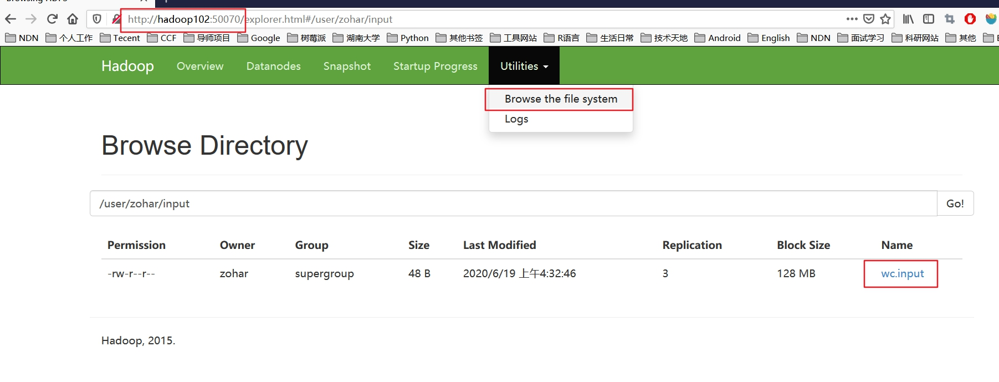
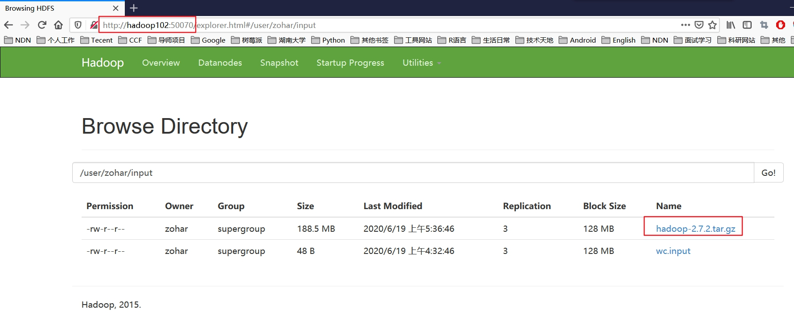
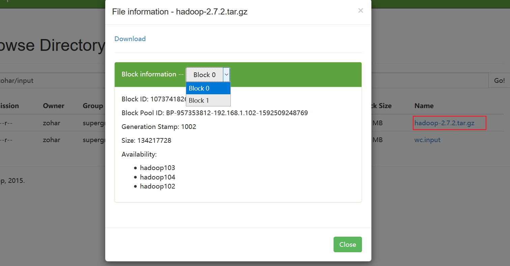

为什么要用SSH免密登录呢？这个是为了提供方便，一个集群肯定会有很多节点，作为一个开发者，虽然可以一个一个的去开启每个节点，但是这样费时费力的事情，尽量还是少做吧，所以出现了这篇博客。用ssh免密登录来群起节点。

下面来看下如何进行配置的。


# 1. 生成公钥和私钥

首先切换到.ssh目录下
```
[zohar@hadoop102 ~]$ pwd
/home/zohar
[zohar@hadoop102 ~]$ cd .ssh/
```

然后生成私钥和公钥：

```
[zohar@hadoop102 ~]$ ssh-keygen -t rsa
Generating public/private rsa key pair.
Enter file in which to save the key (/home/zohar/.ssh/id_rsa): 
Enter passphrase (empty for no passphrase): 
Enter same passphrase again: 
Your identification has been saved in /home/zohar/.ssh/id_rsa.
Your public key has been saved in /home/zohar/.ssh/id_rsa.pub.
The key fingerprint is:
6d:38:65:6f:24:5e:b1:5e:03:6a:3e:27:17:6c:e2:4a zohar@hadoop102
The key's randomart image is:
+--[ RSA 2048]----+
|            o    |
|           o +   |
|          B B o  |
|         X O o . |
|        E O *    |
|       . + *     |
|        .        |
|                 |
|                 |
+-----------------+
```

可以进去文档进行查看：.pub就是公钥，id_rsa就是私钥。
```
[zohar@hadoop102 .ssh]$ ll
总用量 12
-rw-------. 1 zohar zohar 1675 12月 12 10:14 id_rsa
-rw-r--r--. 1 zohar zohar  397 12月 12 10:14 id_rsa.pub
-rw-r--r--. 1 zohar zohar 1215 12月 11 08:51 known_hosts
```

# 2. 将公钥拷贝到需要免密登录的机器上

hadoop102上运行的有namenode节点，需要与所有的datanode节点进行通信，也就是与hadoop102、hadoop103和hadoop104机器进行通信，所以下面操作就是将hadoop102公钥拷贝到3台虚拟机上。

将hadoop102的公钥拷贝自己：

```
[zohar@hadoop102 ~]$ ssh-copy-id hadoop102
```

将hadoop102的公钥拷贝到hadoop103：

```
[zohar@hadoop102 .ssh]$ ssh-copy-id hadoop103
zohar@hadoop103's password: 
Now try logging into the machine, with "ssh 'hadoop103'", and check in:

  .ssh/authorized_keys
```

将hadoop104的公钥拷贝到hadoop104：

```
[zohar@hadoop102 .ssh]$ ssh-copy-id hadoop104
zohar@hadoop104's password: 
Now try logging into the machine, with "ssh 'hadoop104'", and check in:

  .ssh/authorized_keys
```

接下来，由于hadoop103上运行着ResourceManager，所以接下来要在hadoop103上生成ssh公钥和私钥，并将公钥发送给3台虚拟机。

hadoop103机器上生成公钥和私钥：
```
[zohar@hadoop103 .ssh]$ ssh-keygen -t rsa
```

将hadoop103公钥发送到三台机器上：

```
[zohar@hadoop103 .ssh]$ ssh-copy-id hadoop102
[zohar@hadoop103 .ssh]$ ssh-copy-id hadoop103
[zohar@hadoop103 .ssh]$ ssh-copy-id hadoop104
```

下面看一下`.ssh/`目录下生成了哪些内容：
名称|说明
|:-:|:-:|
known_hosts|记录ssh访问过计算机的公钥(public key)
id_rsa|生成的私钥
id_rsa.pub|生成的公钥
authorized_keys|存放授权过得无密登录服务器公钥

当前用户都是zohar下进行操作的，ssh也是针对zohar用户来进行的，但是有时候用到root用户的时候，就不能免密使用ssh了，所以这里还需要对root用户进行免密ssh配置，也就是将hadoop102切换到root用户，然后生成root用户的ssh的公钥和私钥，然后分发到hadoop102、hadoop103和hadoop104三台机器上。具体操作如下：

```
[root@hadoop102 ~]# su - root
[root@hadoop102 ~]# pwd
/root
[root@hadoop102 ~]# cd .ssh/
[root@hadoop102 .ssh]# ssh-keygen -t rsa
[root@hadoop102 .ssh]# ssh-copy-id hadoop102
[root@hadoop102 .ssh]# ssh-copy-id hadoop103
[root@hadoop102 .ssh]# ssh-copy-id hadoop104
```

在102机器上可以测试一下：
```
[zohar@hadoop102 ~]$ ssh hadoop103
Last login: Thu Dec 12 14:08:30 2019 from hadoop102
[zohar@hadoop103 ~]$ ssh hadoop104
Last login: Thu Dec 12 14:08:39 2019 from hadoop102
[zohar@hadoop104 ~]$ 
```
> 可以看到，不用输入密码就可以访问103，104机器了。

到此，SSH免密配置也就完成了，下面看下如何通过ssh来进行群起集群。

# 3. 群起集群

## 3.1. 配置slaves

```
[root@hadoop102 .ssh]# su - zohar
[zohar@hadoop102 ~]$ cd /opt/module/hadoop-2.7.2/
[zohar@hadoop102 hadoop-2.7.2]$ vim etc/hadoop/slaves
```

删除slaves文件中的localhost，并把子节点填入：
```
hadoop102
hadoop103
hadoop104
```

> 注意：这个文件添加的内容不允许有空格、稳重不允许有空行。

## 3.2. 集群全部同步

```
[zohar@hadoop102 hadoop-2.7.2]$ xsync etc/hadoop/slaves
```

## 3.3. 停止所有启动的节点

```
[zohar@hadoop102 hadoop-2.7.2]$ hadoop-daemon.sh stop namenode
[zohar@hadoop102 hadoop-2.7.2]$ hadoop-daemon.sh stop datanode
[zohar@hadoop103 hadoop-2.7.2]$ hadoop-daemon.sh stop datanode
[zohar@hadoop104 hadoop-2.7.2]$ hadoop-daemon.sh stop datanode
```

# 4. 群起集群

## 4.1. 格式化并删除data目录和logs目录

如果集群是第一次启动，需要格式化NameNode（注意格式化之前，一定要先停止上次启动的所有namenode和datanode进程，然后再删除data和log数据）。

```
[zohar@hadoop102 hadoop-2.7.2]$ rm -rf data/ logs/
[zohar@hadoop102 hadoop-2.7.2]$ hdfs namenode -format
```
> 注意：hadoop103和hadoop104两台机器也同样要删除data/和logs/目录。

## 4.2. 启动集群

```
[root@hadoop102 hadoop-2.10.0]# start-dfs.sh 
```

查看3台虚拟机运行情况：
hadoop102:
```
[zohar@hadoop102 hadoop-2.7.2]$ jps
2497 DataNode
2371 NameNode
2735 Jps
```

hadoop103:
```
[root@hadoop103 ~]# su - zohar
[zohar@hadoop103 ~]$ jps
2365 Jps
2287 DataNode
```

hadoop104:
```
[zohar@hadoop104 ~]$ jps
2471 Jps
2311 DataNode
2382 SecondaryNameNode
```

通过上面运行的情况，可以看出与前面博客[hadoop完全分布式配置之集群单点启动](./2019-12-10-大数据学习9--hadoop完全分布式配置之集群单点启动.md)中对集群分布运行情况是一致的。hadoop102运行NameNode和DataNode，hadoop103运行DataNode，hadoop104运行DataNode和SecondaryNameNode。

## 4.3. 启动yarn

在103机器上启动yarn。
> 注意：NameNode和ResourceManger如果不是同一台机器，不能在NameNode上启动 YARN，应该在ResouceManager所在的机器上启动YARN。这里ResourceManager在hadoop103机器上，所以这里在hadoop103机器上启动yarn。

```
[root@hadoop103 hadoop-2.10.0]# sbin/start-yarn.sh 
starting yarn daemons
starting resourcemanager, logging to /opt/module/hadoop-2.10.0/logs/yarn-root-resourcemanager-hadoop103.out
hadoop103: starting nodemanager, logging to /opt/module/hadoop-2.10.0/logs/yarn-root-nodemanager-hadoop103.out
hadoop104: starting nodemanager, logging to /opt/module/hadoop-2.10.0/logs/yarn-root-nodemanager-hadoop104.out
hadoop102: starting nodemanager, logging to /opt/module/hadoop-2.10.0/logs/yarn-root-nodemanager-hadoop102.out
```

查看启动yarn之后的状况：

hadoop102机器上：
```
[zohar@hadoop102 hadoop-2.7.2]$ jps
2896 Jps
2784 NodeManager
2497 DataNode
2371 NameNode
```

hadoop103机器上：
```
[zohar@hadoop103 hadoop-2.7.2]$ jps
2417 ResourceManager
2830 Jps
2527 NodeManager
2287 DataNode
```

hadoop104机器上：
```
[zohar@hadoop104 ~]$ jps
2532 NodeManager
2311 DataNode
2649 Jps
2382 SecondaryNameNode
```

从上面的运行结果看出，运行也和预期安排的一致，即：


## 4.4. 浏览器查看secondarynamenode

```
http://hadoop104:50090/status.html
```


# 5. 集群测试

## 5.1. 上传文件到集群

### 上传小文件

在hdfs上创建input目录：
```
[zohar@hadoop102 hadoop-2.7.2]$ hdfs dfs -mkdir -p /user/zohar/input
```

将本地wc.input文件上传到hdfs上：
```
[zohar@hadoop102 hadoop-2.7.2]$ hdfs dfs -put wcinput/wc.input /user/zohar/input
```

打开浏览器，输入 http://hadoop102:50070 进行查看：


### 上传大文件

这里把`/opt/software/hadoop-2.7.2.tar.gz`上传到hdfs上。这里还是上传到`/user/zohar/input`目录下。

```
[zohar@hadoop102 hadoop-2.7.2]$ hdfs dfs -put /opt/software/hadoop-2.7.2.tar.gz /user/zohar/input
```

打开浏览器，输入 http://hadoop102:50070 进行查看：


点击文件名进行详细查看:


> 可以看到HDFS将文件分为了两块，因为hadoop-2.7.2.tar.gz文件大小已经超过了128M，所以分了2块进行存储。

#### 存储的位置

上传的这些文件存储到什么地方呢？

存储的位置也就是在配置是指定的`data/tmp/.....`下面，具体路径如下：
```
[zohar@hadoop102 subdir0]$ pwd
/opt/module/hadoop-2.7.2/data/tmp/dfs/data/current/BP-957353812-192.168.1.102-1592509248769/current/finalized/subdir0/subdir0
```

查看HDFS在磁盘存储文件内容：
```
[zohar@hadoop102 subdir0]$ cat blk_1073741825
hadoop yarn
hadoop mapreduce
zohar
zhangzhihong
```
> 可以看到该文件就是上传的小文件wc.input文件内容。


对切分了的大文件进行拼接操作，可以还原出原文件：
```
[zohar@hadoop102 subdir0]$ cat blk_1073741826 >> tmp.file
[zohar@hadoop102 subdir0]$ cat blk_1073741827 >> tmp.file
[zohar@hadoop102 subdir0]$ tar -xvzf tmp.file
[zohar@hadoop102 subdir0]$ ll
总用量 387584
-rw-rw-r--. 1 zohar zohar        48 6月  19 04:32 blk_1073741825
-rw-rw-r--. 1 zohar zohar        11 6月  19 04:32 blk_1073741825_1001.meta
-rw-rw-r--. 1 zohar zohar 134217728 6月  19 05:36 blk_1073741826
-rw-rw-r--. 1 zohar zohar   1048583 6月  19 05:36 blk_1073741826_1002.meta
-rw-rw-r--. 1 zohar zohar  63439959 6月  19 05:36 blk_1073741827
-rw-rw-r--. 1 zohar zohar    495635 6月  19 05:36 blk_1073741827_1003.meta
drwxr-xr-x. 9 zohar zohar      4096 5月  22 2017 hadoop-2.7.2
-rw-rw-r--. 1 zohar zohar 197657687 6月  19 05:50 tmp.file
```
> 将两块内容进行拼接，然后对拼接文件进行解压，即可还原出原文件来。


