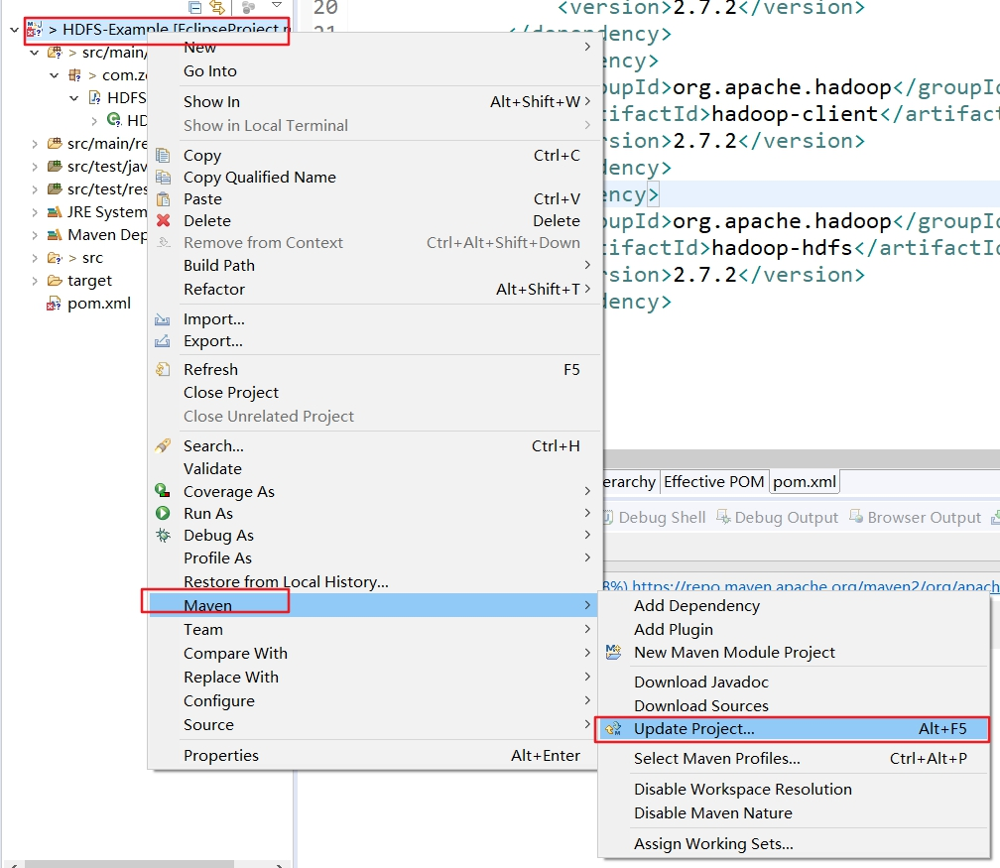
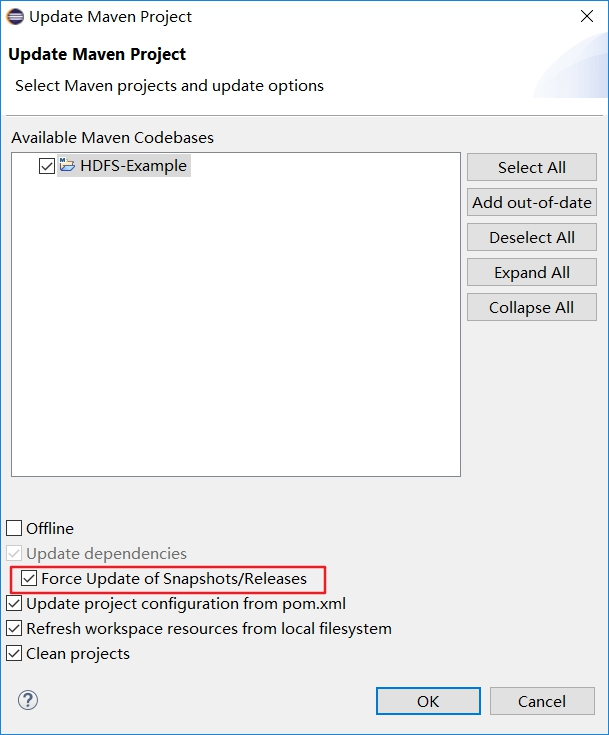
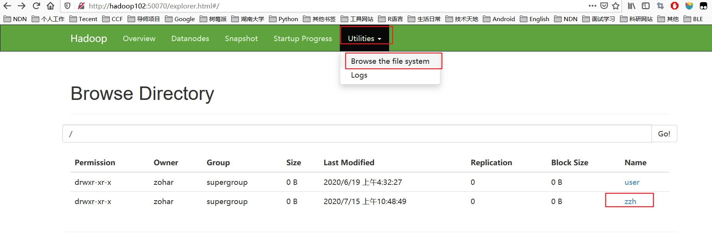

这篇博客主要来讲述如何通过代码实现客户端对HDFS的操作。

<!-- TOC -->

- [1. HDFS客户端环境准备](#1-hdfs客户端环境准备)
	- [1.1. 环境配置步骤](#11-环境配置步骤)
	- [1.2. 问题1](#12-问题1)
	- [1.3. 问题2](#13-问题2)
	- [1.4. 接下来的步骤](#14-接下来的步骤)

<!-- /TOC -->


# 1. HDFS客户端环境准备

## 1.1. 环境配置步骤

1. 根据自己的电脑操作系统选择对应的hadoop jar包到非中文路径下，这里我用的是windows10系统，下面的连接也是在windows10的hadoop jar包，提供给大家下载。

名称|链接|提取码|
|:-:|:-:|:-:|
windows-hadoop-2.7.2.zip|链接：https://pan.baidu.com/s/1MwDfuBO_P5L3ZEcPGldLUg |提取码：uwmz|


2. 配置HADOOP_HOME环境变量，如下图所示：


3. 配置Path环境变量，如下图所示：


4. 创建一个Maven工程HdfsClientDemo

这里使用Eclipse创建Maven工程，具体如下图所示：


5. 导入相应的依赖坐标+日志添加

打开工程的`pom.xml`文件，添加如下依赖：

```xml
<dependencies>
		<dependency>
			<groupId>junit</groupId>
			<artifactId>junit</artifactId>
			<version>RELEASE</version>
		</dependency>
		<dependency>
			<groupId>org.apache.logging.log4j</groupId>
			<artifactId>log4j-core</artifactId>
			<version>2.8.2</version>
		</dependency>
		<dependency>
			<groupId>org.apache.hadoop</groupId>
			<artifactId>hadoop-common</artifactId>
			<version>2.7.2</version>
		</dependency>
		<dependency>
			<groupId>org.apache.hadoop</groupId>
			<artifactId>hadoop-client</artifactId>
			<version>2.7.2</version>
		</dependency>
		<dependency>
			<groupId>org.apache.hadoop</groupId>
			<artifactId>hadoop-hdfs</artifactId>
			<version>2.7.2</version>
		</dependency>
		<dependency>
			<groupId>jdk.tools</groupId>
			<artifactId>jdk.tools</artifactId>
			<version>1.8</version>
			<scope>system</scope>
			<systemPath>${JAVA_HOME}/lib/tools.jar</systemPath>
		</dependency>
</dependencies>
```

接下来，Eclipse就会下载这些依赖，可以看到右下角有进度条显示，自己可以点击查看下载的进度。如下图所示：


等待下载完毕进行下面的操作。

## 1.2. 问题1
 另外如果发现`pom.xml`文件中会有报错，那么就按照下面的操作来对Maven工程进行强制的更新。
 1. 首先选中工程，右键选择<kbd>Maven</kbd>，然后选择<kbd>Update Project</kbd>，如下图所示：
 
 2. 在弹出的对话框，勾选<kbd>Force Update of Snapshots/Release</kbd>，如下图所示：
 
 3. 接下来就是下载更新maven工程了。

## 1.3. 问题2
 如果发现是`Missing artifact jdk.tools:jdk.tools:jar:1.8`错误，那么把下面的依赖添加到`pom.xml`中：

 ```
 			<dependency>
				<groupId>jdk.tools</groupId>
				<artifactId>jdk.tools</artifactId>
				<version>1.8</version>
				<scope>system</scope>
				<systemPath>${JAVA_HOME}/lib/tools.jar</systemPath>
			</dependency>
 ```

然后重新运行一下Maven工程既可看到error消失。

## 1.4. 接下来的步骤

6. 创建包名

在`src/main/java/`下创建`com.zohar.hdfs`包名。

7. 创建HDFSClient类

在HDFSClient类中输入如下代码（也就是就是在HDFS中创建一个文件夹的代码）：
```
public class HDFSClient {
	
	public static void main(String[] args) throws IllegalArgumentException, IOException {
		 // 1. 获取hdfs客户端对象
		Configuration conf = new Configuration();
		// 通过configuration访问HADOOP集群，也就是访问的是namenode节点。
		conf.set("fs.defaultFS", "hdfs://hadoop102:9000");
		FileSystem fs = FileSystem.get(conf);
		
		// 2. 在hdfs创建路径
		fs.mkdirs(new Path("/zzh/haha"));
		
		//3. 关闭资源
		fs.close();
	}
	
}
```

9. 运行

点击运行之后，会弹出log4j相关的一些问题，具体如下所示：

```
og4j:WARN No appenders could be found for logger (org.apache.hadoop.metrics2.lib.MutableMetricsFactory).
log4j:WARN Please initialize the log4j system properly.
log4j:WARN See http://logging.apache.org/log4j/1.2/faq.html#noconfig for more info.
```

解决办法：
需要在项目的`src/main/resources`目录下，新建一个文件，命名为`log4j.properties`，并在文件中输入如下内容：
```
log4j.rootLogger=INFO, stdout
log4j.appender.stdout=org.apache.log4j.ConsoleAppender
log4j.appender.stdout.layout=org.apache.log4j.PatternLayout
log4j.appender.stdout.layout.ConversionPattern=%d %p [%c] - %m%n
log4j.appender.logfile=org.apache.log4j.FileAppender
log4j.appender.logfile.File=target/spring.log
log4j.appender.logfile.layout=org.apache.log4j.PatternLayout
log4j.appender.logfile.layout.ConversionPattern=%d %p [%c] - %m%n
```

接下来再运行一下，就可以发现上面的那个问题也就没有了。

10. 再次运行

再次运行发现还是错误，错误信息如下所示：


解决办法：

1. 首先查看一下主机与虚拟机是否ping通，如果ping不通需要保障主机与虚拟机相通，具体设置请参考我的博客文章。

2. 确保虚拟机上面的Hadoop相关组件都已经设置好了并且已经打开了（这里我是没有打开Hadoop才会报上面的错误，具体打开Hadoop请参考我的博客文章[集群启动关闭总结](./2020-06-18-大数据学习14-集群启动关闭总结.md)）。

再次运行可以发现没有error了。

11. 查看结果

打开浏览器输入：```http://hadoop102:50070/```，可以发现创建了代码设置的目录。




